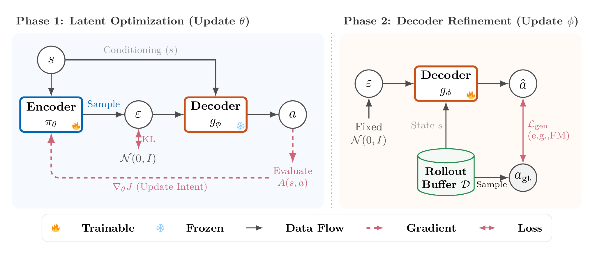
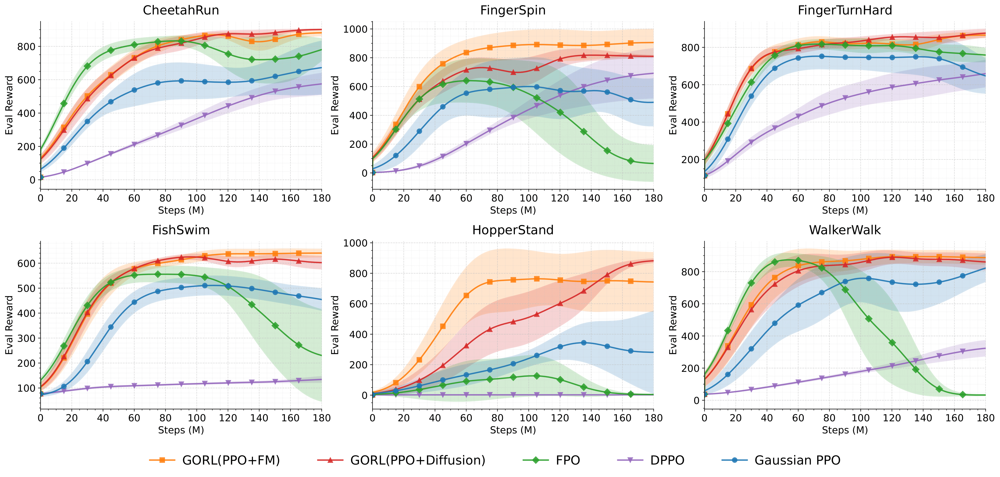

# GoRL: An Algorithm-Agnostic Framework for Online RL with Generative Policies


*Chubin Zhang\*<sup>1</sup>,
Zhenglin Wan\*<sup>2</sup>,
Feng Chen<sup>2</sup>,
Xingrui Yu<sup>3</sup>,
Ivor Tsang<sup>3</sup>,
Bo An<sup>2</sup>*

<sup>1</sup>BUPT, China
<sup>2</sup>NTU, Singapore  <sup>3</sup>Centre for Frontier AI Research, A*STAR, Singapore 

(\*: Equal contribution)
<p align="center">
  <a href="https://arxiv.org/abs/2512.02581">
    </a>
  &nbsp;
  <a href="https://github.com/bennidict23/GoRL">
    </a>
</p>

**GoRL（Generative Online Reinforcement Learning）** is a framework that enables stable online RL with generative policies (Flow Matching / Diffusion) via latent-generative factorization.

## 📖 Table of Contents

- [Key Features](#-key-features)
- [Method](#-method)
- [Directory Structure](#-directory-structure)
- [Installation](#-installation)
- [Usage](#-usage)
- [Results](#-results)
- [Acknowledgement](#-acknowledgement)
- [Citation](#-citation)
- [License](#-license)

## ✨ Key Features

| Feature | Description |
| ------- | ----------- |
| **Structural Decoupling** | Separates decision intent (Encoder) from physical execution (Decoder) to resolve the stability-expressiveness tension |
| **Algorithm-Agnostic** | Modular design compatible with any RL optimizer (e.g., PPO, SAC) for the latent policy |
| **Generative Expressiveness** | Supports Flow Matching and Diffusion to model complex, multimodal action distributions |
| **Stable Optimization** | Avoids deep gradient backpropagation by computing updates in a tractable latent space |
| **Two-Time-Scale Schedule** | Alternates between policy optimization and generative refinement |

## 🧠 Method

Standard generative policies often fail in online RL due to intractable likelihoods and noisy gradients. GoRL addresses this via a **Latent-Generative Factorization**:

$$\pi(a|s) = \int \pi_\phi(a|s, \varepsilon) \, \pi_\theta(\varepsilon|s) \, d\varepsilon$$

<p align="center">
    
</p>

The framework consists of two distinct components:

- **Encoder** $\pi_\theta(\varepsilon|s)$ (Decision Intent): A tractable latent policy (optimized via PPO) that learns high-level intents in a tractable Gaussian space.
- **Decoder** $g_\phi(s, \varepsilon)$ (Physical Execution): A conditional generative model (optimized via Flow Matching or Diffusion) that translates latent intents into complex, multimodal actions.

**Why it works:** Instead of optimizing the generative model directly in action space (which causes instability), GoRL performs stable gradient updates on the encoder. The decoder is trained separately via supervised regression to map a Fixed Gaussian Prior $\mathcal{N}(0,I)$ to high-reward actions, ensuring robust improvement without stagnation.

The training proceeds in multiple stages:

1. **Stage 0**: Initialize decoder as identity mapping, train encoder with PPO
2. **Stage 1+**: Collect data → Update decoder → Update encoder → Repeat

## 📂 Directory Structure

```
.
├── scripts/
│   ├── run_gorl_fm.py           - Main script: GoRL with Flow Matching
│   ├── run_gorl_diffusion.py    - Main script: GoRL with Diffusion
│   ├── train_ppo.py             - Baseline: Gaussian PPO
│   ├── train_fpo.py             - Baseline: Flow Policy Optimization
│   └── components/              - Internal pipeline scripts
│
└── src/flow_policy/
    ├── encoder_ppo.py           - Encoder (PPO in latent space)
    ├── decoder_fm.py            - Decoder (Flow Matching)
    ├── decoder_diffusion.py     - Decoder (Diffusion)
    ├── agent.py                 - Combined Encoder + Decoder agent
    ├── ppo.py                   - PPO implementation
    ├── fpo.py                   - FPO implementation
    ├── networks.py              - Neural network architectures
    └── rollouts.py              - Trajectory collection utilities
```

## 🛠️ Installation

Tested with Python 3.12 on CUDA GPUs.

```bash
# Clone the repository
git clone https://github.com/bennidict23/GoRL.git
cd GoRL

# Create conda environment
conda create -n GoRL python=3.12
conda activate GoRL

# Install dependencies
pip install -r requirements.txt
```

## 🚀 Usage

### GoRL

```bash
# GoRL with Flow Matching
CUDA_VISIBLE_DEVICES=0 python scripts/run_gorl_fm.py --env_name FingerSpin --num_stages 4 --seed 1

# GoRL with Diffusion
CUDA_VISIBLE_DEVICES=0 python scripts/run_gorl_diffusion.py --env_name FingerSpin --num_stages 4 --seed 1
```

### Baselines

```bash
# PPO
CUDA_VISIBLE_DEVICES=0 python scripts/train_ppo.py --env_name FingerSpin --seed 1

# FPO
CUDA_VISIBLE_DEVICES=0 python scripts/train_fpo.py --env_name FingerSpin --seed 1

# DPPO
CUDA_VISIBLE_DEVICES=0 python scripts/train_fpo.py --env_name FingerSpin --seed 1 --config.loss_mode denoising_mdp
```

Run with `--help` to see all available options.

## 📊 Results

We evaluate GoRL on 6 MuJoCo continuous control tasks from DMControl, comparing against FPO, DPPO, and Gaussian PPO baselines.

<p align="center">
    
</p>

GoRL (PPO+FM) and GoRL (PPO+Diffusion) achieve competitive or superior performance across all environments, demonstrating the effectiveness of the latent-generative factorization approach.

## 🙏 Acknowledgement

Our PPO and FPO implementations are based on the official [FPO repository](https://github.com/akanazawa/fpo) and follow the hyperparameters from the original paper. We thank the authors for open-sourcing their code.

## 📝 Citation

If you find this code useful, please cite our paper:

```bibtex
@misc{zhang2025gorlalgorithmagnosticframeworkonline,
      title={GoRL: An Algorithm-Agnostic Framework for Online Reinforcement Learning with Generative Policies}, 
      author={Chubin Zhang and Zhenglin Wan and Feng Chen and Xingrui Yu and Ivor Tsang and Bo An},
      year={2025},
      eprint={2512.02581},
      archivePrefix={arXiv},
      primaryClass={cs.LG},
      url={https://arxiv.org/abs/2512.02581}, 
}
```

## 📄 License

MIT License